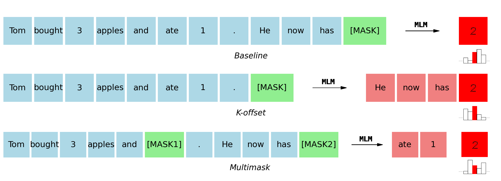

# 🎭Inconsistencies in Masked Language Models
Masked language models (e.g., UL2, T5, PaLM2) potentially learn inconsistent distributions of tokens. Inference-time ensembling can improve their accuracies.



*Figure 1: We prompt the model for different versions of the same distribution to measure their inconsistency and ensemble them to improve accuracy.*

*Our distribution of interest is P(?|Tom bought 4 apples and ate 2. He now has).   ? can be 2.*


*Figure 2: Ensembling different versions of the same distribution improves accuracy. Aggregated results from 2 models on 3 datasets.*


## Abstract

Learning to predict masked tokens in a sequence has been shown to be a helpful pretraining objective for powerful language models such as PaLM2. After training, such masked language models (MLMs) can provide distributions of tokens in the masked positions in a sequence. However, this paper shows that distributions corresponding to different masking patterns can demonstrate considerable inconsistencies, i.e., they cannot be derived from a coherent joint distribution when considered together. 

This fundamental flaw in MLMs can lead to self-contradictory behaviors during inference. On various benchmark datasets including MMLU, MLMs can give different predictions to the same input question. From BERT-base to UL2-20B, we show that such inconsistencies exist ubiquitously in MLMs of diverse sizes and configurations. In light of our observations, we further propose an inference-time strategy for MLMs called Ensemble of Conditionals. It jointly considers a selected range of inconsistent conditionals directly produced by the MLM for the final prediction, which often leads to considerable accuracy improvement.

## How to run

To set up environment:

```
conda create --name inconsistencies python=3.11.5
conda activate inconsistencies
pip install -r requirements.txt
```

To run experiments on MMLU and BigBench with UL2-20B and T5-11B, use 
```
main.ipynb
```

## Acknowledgments

We thank [Fuzhao Xue](https://xuefuzhao.github.io/) and [Shenggui Li](https://franklee.xyz/) for the valuable discussions.

